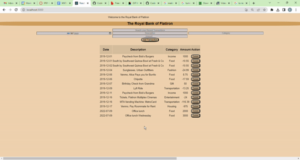
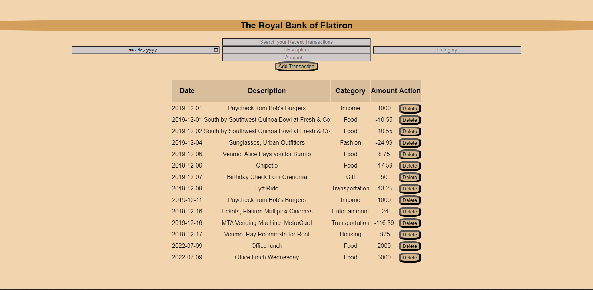

Bank of Flatiron

Welcome to the Bank of Flatiron, where you can trust us with all your financial data! Use the below gif as an example of how the app should function.

Instructions
For this project, you’ll be building out a React application that displays a list of your recent bank transactions, among other features.

Part of what this code challenge is testing is your ability to follow given instructions. While you will definitely have a significant amount of freedom in how you implement the features, be sure to carefully read the directions for setting up the application.

Setup
After unbundling the project:

Run npm install in your terminal.
Run npm run server. This will run your backend on port 8001.
In a new terminal, run npm start. This will run your React app on port 8000.
Make sure to open http://localhost:8001/transactions in the browser to verify that your backend is working before you proceed!

Endpoints
The base URL for your backend is: http://localhost:8001

Core Deliverables
As a user, I should be able to:

See a table of the transactions.
Fill out and submit the form to add a new transaction. This should add the new transaction to the table as well as post the new transaction to the backend API for persistence.
Filter transactions by typing into the search by typing into the search bar. Only transactions with a description matching the search term should be shown in the transactions table.